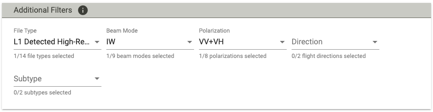
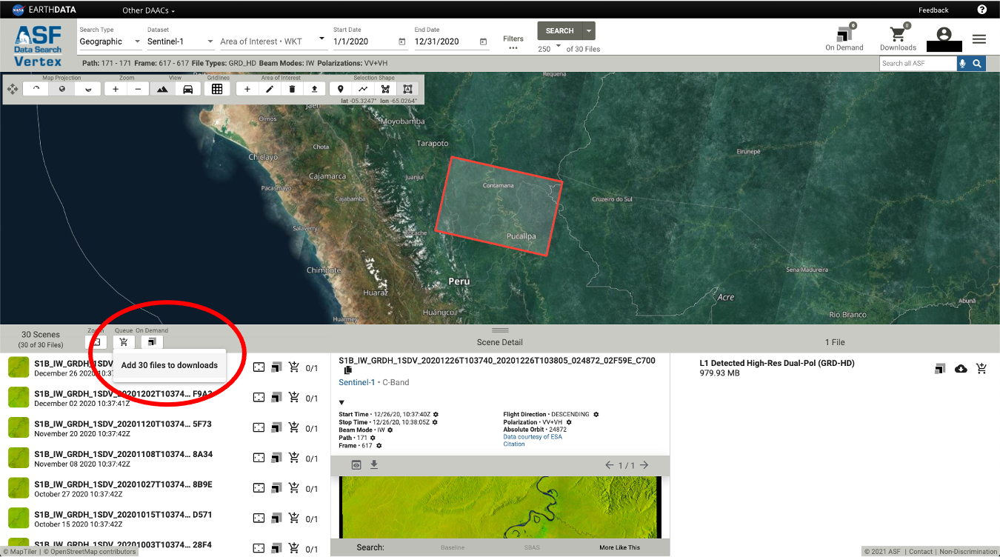

# Data Stack Preparation (data-prep)

## Set up data-prep conda environment ##

To create **data-prep** environment and install required packages:

```bash
(base) % conda env create -f data-prep-env.yml
```

Activate **data-prep** environment:

```bash
(base) % conda activate data-prep
(data-prep) % 
```

Run **setup.py**:

```bash
(data-prep) % python setup.py
```

## Prepare UTM tiles for AOI ##

### prep_tiles.py ###

### Usage ###

```
(data-prep) % prep_tiles.py [-h] (--aoishp aoishp | --admshp admshp) aoi_name tile_size
```

### Description ###

Prepare boundary and tiles for AOI.

### Positional Arguments ###

  **aoi_name**

    name of area of interest (AOI)

  **tile_size**        

    tile size in meters

### Optional Arguments ###

  **--aoishp**
  
    aoishp  shp/geojson of AOI

  **--admshp** 

    admshp  shp/geojson of subnational administrative boundaries


## Sentinel-1 ##

## Search Sentinel-1 granules on [ASF Vertex](https://search.asf.alaska.edu/#/) ##

1. Sign in using your Earthdata credentials. If you haven't used ASF Vertex before, you will need to agree their terms in order to use their HyP3 processing.

2. Use following "Additional Filters" when searching granules for your AOI:

    * File Type: L1 Detected High-Res Dual-Pol (GRD-HD)
    * Beam Mode: IW
    * Polarization: VV+VH

    

3. Add selected granules into download queue:

    

4. Download metadata files. At least download one csv or geojson file, which will be used for submitting HyP3 jobs.

    

5. Clear the selected granules in the downloads. Do not download these GRD-HD products as we will submit HyP3 jobs to apply radiometric terrain correction (RTC) to them.

## Submit HyP3 RTC jobs ##

### s1_submit_hyp3_jobs.py ###

### Usage ###

```
(data-prep) % s1_submit_hyp3_jobs.py [-h] [--dst dstpath] csv/geojson
```

### Description ###
    
Submit ASF HyP3 RTC processing jobs for Sentinel-1 granules.

Optionally copy or download the processed granules to the following destinations:

* AWS S3 bucket - s3://bucket/prefix

* Google Cloud Storage (GCS) - gs://bucket/prefix

* Local storage

### Positional Arguments ###

  **csv/geojson**
  
      Metadata file (csv or geojson) downloaded from ASF Vertex after data search.
  
### Optional Arguments ###

  **--dst dstpath**
  
      Destination path to store the processed granules.
      Supported dstpaths: AWS S3 - s3://your_bucket/some_prefix
                       GCS - gs://your_bucket/some_prefix
                       Local storage - your_local_path
      If dstpath not provided, AWS S3 buckets/keys for the processed granules will be displayed at the end.
      The processed granules will be saved in the following directory structure:
          dstpath
           └──year
               └──path_frame
                   └──processed_granules

### Notes ###

* Since ASF HyP3 stores the processed granules in their AWS S3 buckets, the data transfer will be much faster if you set up your S3 bucket to host these data. That is, using **s3://your_bucket/some_prefix** for --dst option.

* To set up AWS Command Line Interface (CLI) configurations and credentials (required if your dstpath is S3 or GCS):

    ```
    (data-prep) % aws configure
    ```

    where you will be asked to enter your **aws_access_key_id** and **aws_secret_access_key**.

* To set up Google Cloud gsutil tool (required if your dstpath is GCS):

    ```
    (data-prep) % gsutil config
    ```

    Then you will be prompted to sign in using your Google credentials. 

### Examples ###

* Run without --dst option

```
(data-prep) % s1_submit_hyp3_jobs.py 2017_94_215.geojson
Destination path for processed granules not provided. The download links will be listed at the end.

Enter Earthdata Username: xxxxxx
Enter Earthdata Password: 

Your remaining quota for HyP3 jobs: 977 granules.

You will be submitting the following granules for HyP3 RTC processing:
    2017_94_215 - 23 granules

Enter 'Y' to confirm you would like to submit these granules, or 'N' if you have already submitted the granules and want to copy the processed granules to your dstpath: N

Your processed granules for year_path_frame 2017_94_215 are available here:

hyp3-contentbucket-abcdefghijkl/12345abc-wxyz-1234-5678-opqrstuvwxyz/S1B_IW_20170111T032030_DVP_RTC30_G_gpunem_C229.zip
Expiration Time: 2021-09-18 00:00:00+00:00

...
...

Done with everything.
```

* Run with --dst option pointed to a S3 bucket

```
(data-prep) % s1_submit_hyp3_jobs.py 2017_94_215.geojson --dst s3://servir-public/test

Enter Earthdata Username: xxxxxx
Enter Earthdata Password: 

Your remaining quota for HyP3 jobs: 977 granules.

You will be submitting the following granules for HyP3 RTC processing:
    2017_94_215 - 23 granules

Enter 'Y' to confirm you would like to submit these granules, or 'N' if you have already submitted the granules and want to copy the processed granules to your dstpath: N

2017_94_215: copying processed granules to s3://servir-public/test
2017_94_215: DONE copying processed granules to s3://servir-public/test

Done with everything.
```

## Sentinel-1 Processing ##

### s1_proc.py ###

### Usage ###

```
(data-prep) % s1_proc.py [-h] [--pf path_frame] [--m1 m1] [--m2 m2] srcpath year
```

### Description ###
    
Processing Sentinel-1 RTC data, which includes two steps:

1. Calculating temporal mean for the Sentinel-1 granules acquired between the months \[m1, m2\]. This is done by **s1_build_vrt.py** and **calc_vrt_stats.py**.

2. Removing left/right (cross-track) edge pixels where the border noise is prominent. This is done by **remove_edges.py**.

### Positional Arguments ###

  **srcpath**
  
      Source path to where processed granules are stored.
      Supported dstpaths: AWS S3 - s3://your_bucket/some_prefix
                          GCS - gs://your_bucket/some_prefix
                          Local storage - your_local_path
  
  **year**
      
      Year of granules to be processed.

  
### Optional Arguments ###

  **--pf path_frame**
  
      'path_frame' of granules to be processed.
      If path_frame not provided, all path_frame's under srcpath/year will be processed.
  
  **--m1 m1**
  
      Granules with acquisition month >= m1 will be processed
  
  **--m2 m2**
  
      Granules with acquisition month <= m2 will be processed

### Notes ###

* The processing will be slow if srcpath is on AWS S3 or GCS because it requires heavy network I/O between the cloud and your local machine. If srcpath is on AWS S3, it is strongly recommended that you run the processing on AWS EC2.


### s1_build_vrt.py ###

### Usage ###

```
(data-prep) % s1_build_vrt.py [-h] [--m1 m1] [--m2 m2] layer srcpath year_path_frame
```

### Description ###

Building Virtual Raster (VRT) to contain time-series of Sentinel-1 processed granules.

### Positional Arguments ###

  **srcpath**
  
      Source path to where processed granules are stored.
      Supported dstpaths: AWS S3 - s3://your_bucket/some_prefix
                          GCS - gs://your_bucket/some_prefix
                          Local storage - your_local_path
  
  **year_path_frame**
      
      Year_Path_Frame of processed granules. e.g., 2020_171_617
      
  **layer**
      
      data layer of processed granules to be included in VRT (VV / VH / INC / LS)
      
### Optional Arguments ###

  **--m1 m1**
  
      Granules with acquisition month >= m1 will be processed
  
  **--m2 m2**
  
      Granules with acquisition month <= m2 will be processed
      
      
      
      
### s1_remove_edges.py ###

### Usage ###

```
(data-prep) % s1_remove_edgges.py [-h] [--edge_depth edge_depth] path_frame_dir
```

### Description ###

Remove left/right edges (cross-track direction) of Sentinel-1 RTC product. 

### Positional Arguments ###

  **path_frame_dir**
   
      directory of path-frame (s3|gs://bucket/prefix/year/path_frame or
      local_path/year/path_frame)

### Optional Arguments ###

  **edge_depth**
   
      edge depth to be removed. If not provided, default is 200
      
      
      
      

### s1_metadata_summary.py ###

### Usage ###

```
(data-prep) % s1_metadata_summary.py [-h] metadata
```
   
### Description ###

Display summary information about metadata from ASF vertex. Will display all granule names grouped by their path_year_frame.


### Positional Arguements ###

  **metadata**
      
      cvs/geojson file downloaded from ASF Vertex after data search    
  


## ALOS-2 ##

## Download ALOS/ALOS-2 Mosaic ##

### alos2_download_mosaic.py ###

### Usage ###

```
(data-prep) % alos2_download_mosaic.py [-h] aoi year dst
```

### Description ###

Download ALOS/ALOS-2 Mosaic data from JAXA website.

### Positional Arguments ###

  **aoi**

      shp/geojson of area of interest (AOI)

  **year**

      Year

  **dst**

      Destination location (s3:// or gs:// or local paths). Downloaded data will be stored under dst/year/tarfiles/

### Notes ###

* Downloading ALOS/ALOS-2 Mosaic data requires a JAXA account, which can be registered from: https://www.eorc.jaxa.jp/ALOS/en/palsar_fnf/registration.htm.


## Landsat ##

## Export Landsat NDVI ##

### gee_export_landsat_ndvi.py ###

### Usage ###

```
(data-prep) % gee_export_landsat_ndvi.py [-h] sitename tiles res year
```

### Description ###

Submit GEE processing for Landsat NDVI. 

### Positional Arguments ###

  **sitename**

      sitename 

  **tiles**

      shp/geojson file containing tiles onto which output raster will be resampled

  **res**

      Resolution
      
  **year**

      Year
      
      
      
      
## MODIS ##

## Export MODIS Tree Cover ##

### gee_export_modis_tc.py ###

### Usage ###

```
(data-prep) % gee_export_modis_tc.py [-h] sitename tiles res year
```

### Description ###

Submit GEE processing for MODIS tree cover

### Positional Arguments ###

  **sitename**

      sitename 

  **tiles**

      shp/geojson file containing tiles onto which output raster will be resampled

  **res**

      Resolution
      
  **year**

      Year. 
      


## Build Stacks ##

### build_stacks.py ###

### Usage ###

```
(data-prep) % build_stacks.py [-h] [--sitename sitename] proj_dir tiles year
```

### Description ###

Build 8 band stacks that include (C-VV / C-VH / C-INC / L-HH / L-HV / L-INC / NDVI / TC)
   
### Positional Arguments ###

  **proj_dir**
   
      project directory (s3:// or gs:// or local dirs)
  
  **tiles**
  
      shp/geojson file that contains tiles for the output stacks
      
  **year** 
  
      Year
      
###  Optional Arguements ###
      
  **sitename**
  
      sitename. If sitename not specified, proj_dir basename is used at sitename. 
  
### Notes ###

* Will build VRT for each EPSG (UTM Zone) given the temporal averages of Sentinel-1 granules per year_path_frame for the respective layers (VV / VH / INC). Then, will build VRT over all zones for the respective layers.
* ALOS-2 VRT already expected to be created from alos2_proc.py.
* ....


### build_stacks_para.py ###

### Usage ###

```
(data-prep) % build_stacks_para.py [-h] [--sitename sitename] proj_dir tiles year
```

### Description ###

Build 9 band stacks that include (C-VV / C-VH / C-INC / L-HH / L-HV / L-INC / NDVI / TC / PRODES)
   
### Positional Arguments ###

  **proj_dir**
   
      project directory (s3:// or gs:// or local dirs)
  
  **tiles**
  
      shp/geojson file that contains tiles for the output stacks
      
  **year** 
  
      Year
      
###  Optional Arguements ###
      
  **sitename**
  
      sitename. If sitename not specified, proj_dir basename is used at sitename. 
  
### Notes ###

* Works similarly to build_stacks.py, with the addition of the PRODES dataset.


### build_condensed_stacks.py ###

### Usage ###

```
(data-prep) % build_condensed_stacks.py [-h] [--sitename sitename] proj_dir tiles year
```

### Description ###

Build 4 band condensed stacks that include (C-RVIx100, L-RVIx100, NDVIx100, TC)
   
### Positional Arguments ###

  **proj_dir**
   
      project directory (s3:// or gs:// or local dirs)
  
  **tiles**
  
      shp/geojson file that contains tiles for the output stacks
      
  **year** 
  
      Year
      
###  Optional Arguements ###
      
  **sitename**
  
      sitename. If sitename not specified, proj_dir basename is used at sitename. 
  
### Notes ###

* ???


### build_condensed_stacks_para.py ###

### Usage ###

```
(data-prep) % build_condensed_stacks_para.py [-h] [--sitename sitename] proj_dir tiles year
```

### Description ###

Build 5 band condensed stacks that include (C-RVIx100, L-RVIx100, NDVIx100, TC, PRODES)
   
### Positional Arguments ###

  **proj_dir**
   
      project directory (s3:// or gs:// or local dirs)
  
  **tiles**
  
      shp/geojson file that contains tiles for the output stacks
      
  **year** 
  
      Year
      
###  Optional Arguements ###
      
  **sitename**
  
      sitename. If sitename not specified, proj_dir basename is used at sitename. 
  
### Notes ###

* Works similarly to build_condensed_stacks.py, with the addition of the PRODES dataset.


```python

```
